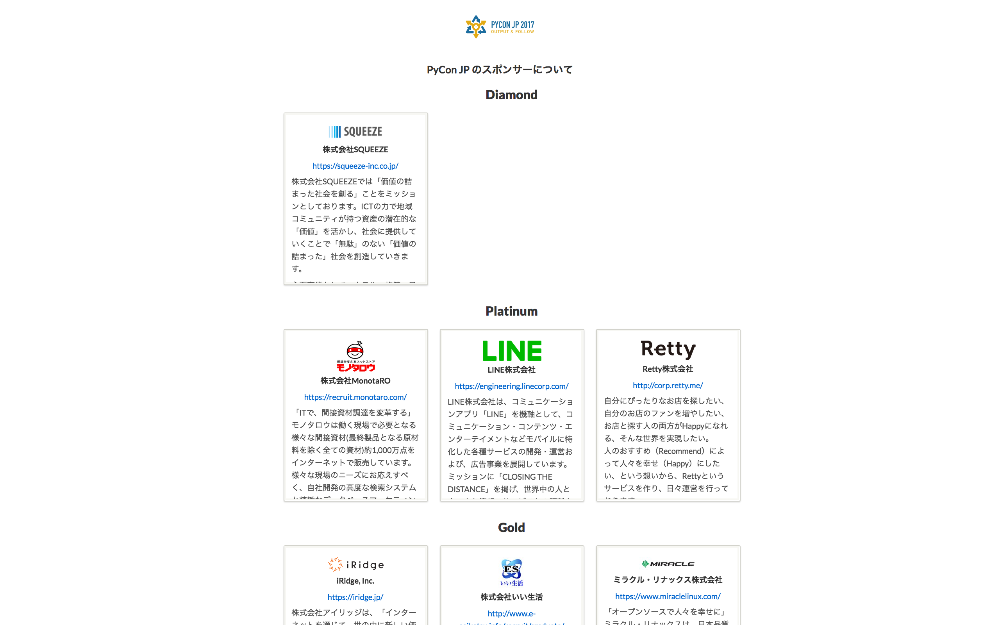
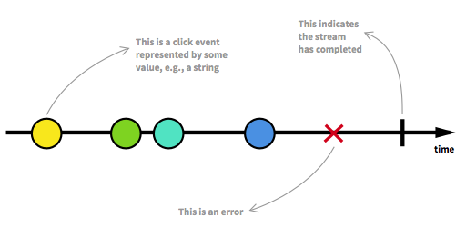
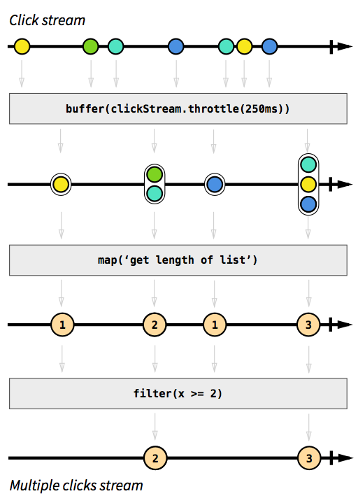

##  RxJSコトハジメ

slideship Tech Dive v1.0 | 2017/07/25 | Masataka Arai

----

## お前誰よ？


* Masataka Arai [@massa142][1]
* [SQUEEZE Inc.][2]
* [Pythonもくもく会][3]
* PyCon JP スタッフ

[1]: http://massa142.github.io/
[2]: https://squeeze-inc.co.jp/
[3]: https://mokupy.connpass.com/

----

## 会社紹介


* 設立: 2014/09
* 社員数: 25名
* 事業: インバウンド、ホスピタリティ関連
    * 旅館・ホテル・民泊の空き部屋問題の解消
    * 地域活性化（地域コミュニティが持つ資産の活用）

[1]: https://squeeze-inc.co.jp/

-----

## PyCon JP 2017



----

## Agenda

* RxJSってなに？
* リアクティブプログラミングってなに？
* RxJSのはじめかた
* マーブルテスト
* おわりに

----

## RxJSってなに？

-----

* The Reactive Extensions for JavaScript
* もともとMicrosoftがC#向けのライブラリとして設計・開発したもの
* これをJSに移植したのがRxJS
* 他にもいろんな言語に対応
  * http://reactivex.io/languages.html

----


## リアクティブプログラミングってなに？

-----


> ReactiveX is a combination of the best ideas from
  the Observer pattern, the Iterator pattern, and functional programming
  
ReactiveXとはオブザーバパターンとイテレータパターン、関数型プログラミングの良いアイデアを組み合わせたもの

Ref: http://reactivex.io/

-----



Ref: https://gist.github.com/staltz/868e7e9bc2a7b8c1f754

-----



Ref: https://gist.github.com/staltz/868e7e9bc2a7b8c1f754

-----

### stream

時間軸に沿って配列のように操作できる監視可能な非同期イベントの集合をstream(ストリーム)と呼んで扱う
+ タイマー / クリックなどのイベント / 非同期通信

=> `オブザーバパターン + イテレータパターン`

### operator

filterやmapなど、このストリームに処理を加えるAPIのことをoperator(オペレータ)と呼ぶ

=> `関数型プログラミング`

----

## RxJSのはじめかた

-----

### version4
https://github.com/Reactive-Extensions/RxJS
+ JavaScript

### version5
https://github.com/ReactiveX/RxJS
+ TypeScript
+ Release Date: 2016/12/13

-----

### npm 

```text
$ npm install rxjs
```

### CDN

```html
<script src="https://unpkg.com/rxjs@5.4.2/bundles/Rx.min.js"></script>
```

-----

+ ユーザの文字入力によるインクリメンタルサーチを作ってみる
+ リクエスト回数を抑えるために100msのバッファタイムを設定

-----

```js
import { Observable } from "rxjs/observable";
import { Scheduler } from "rxjs/Scheduler";

export const incrementalSearch = (
  input: Observable<string>, scheduler?: Scheduler
): Observable<string> => {
  return input
    .bufferTime(100, null, scheduler)
    .filter(s => s.length > 0)
    .map(s => s.join(""))
    .scan((acc, s) => acc + s);
};
```

----

## マーブルテスト

-----

+ コードにマーブルダイアグラムを落とし込んでテストできる仕組みが5系から導入
    + マーブルダイアグラム: さっきにも出てきたストリーム図
+ '--a---b---|'
    + 20ms目にa,60ms目にbをemitして100ms目に完了するObseravableを表現

-----

```js
  beforeEach(() => {
    testScheduler = new TestScheduler(assert.deepEqual);
    cold = testScheduler.createColdObservable.bind(testScheduler);
  });

  it("100ms毎に検索を実行", () => {
    const input  = cold("a-b-c---d-e-fg--h-i-", { a: "s", b: "l", c: "i", d: "d", e: "e", f: "s", g: "h", h: "i", i: "p" });
    const expected =    "---------j---------k";
    const actual = incrementalSearch(input, testScheduler);
    testScheduler.expectObservable(actual).toBe(expected, { j: "slid", k: "slideship" });
    testScheduler.flush();
  });
```

----

## おわりに

-----

+ 一貫性を持って非同期処理やイベント処理が書ける
    + callback地獄を解決
+ Rxは他の言語にも応用できる考え方
+ 思ってたよりもweb上の情報が多くて安心
+ RxJSが内包されているAngular楽しいよ

```js
  this.http.get('https://example.com/people')
    .map(res => res.json())
    .subscribe(
        people => this.people = people;
    )
```

-----

## 参考にしたもの

+ [The introduction to Reactive Programming you’ve been missing](https://gist.github.com/staltz/868e7e9bc2a7b8c1f754)
+ [【翻訳】あなたが求めていたリアクティブプログラミング入門](http://ninjinkun.hatenablog.com/entry/introrxja)
+ [Rx(JS)に入門する前に知っておきたいN個のこと](http://blog.mmmcorp.co.jp/blog/2015/12/20/prepare-to-rxjs/)
+ [RxJS(5.x)で行うテストファーストな機能開発](http://blog.mmmcorp.co.jp/blog/2016/06/25/testing-rxjs-5/)
+ [ RxJS入門 | CodeGrid](https://app.codegrid.net/series/2017-rxjs)

----

## Thanks !! 😊


